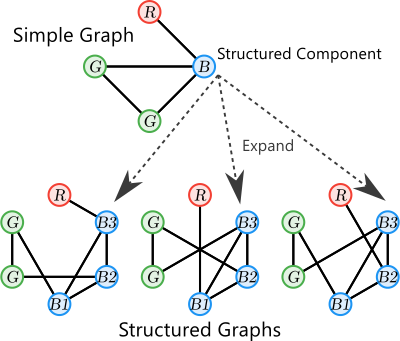

## Graphs with Structured Components

The code in this part of the project supports the enumeration of graphs with *structured* components.
This code was developed by [Shangting Li](https://github.com/shangtingli) and [Daniel Herber](https://github.com/danielrherber).

---
### Definitions and Usage
See the technical report at the following [link](https://ise.illinois.edu/undergraduate/research-experience/reu-projects/enumeration-of-design-architecture.pdf) for more information.

**Structured Component**: Every component has a specified number of ports indicating how many connections to the component are allowed. A simple component is defined as a component where the labeling of the individual connections is not important, while the distinction between connections is essential for structured components. An example of a structured component would be a planetary gear. This type of gear can be represented as a 3-port component but these ports represent the sun, ring, and planet gears, respectively.

**Structured Graph**: In a structured graph, every structured component is represented by a complete graph with the number of vertices equal to the number of ports. Each vertex is uniquely labeled so that the connections are unique and discernible.

**Usage**: To specify which component types should be structured, use ```NSC.S```. A 1 indicates a structured component type and 0 indicates a simple component type. For example, if the first and third components are structured and the remaining 3 are simple, then one would write:
```matlab
NSC.S = [1 0 1 0 0]
```

---
### Examples
* See [PMA_EX_STRUCT_Example1.m](../examples/structured/PMA_EX_STRUCT_Example1.m) for simple example with structured components
```matlab
open PMA_EX_STRUCT_Example1.m
```
* See [PMA_EX_STRUCT_Bayrak2016.m](../examples/structured/PMA_EX_STRUCT_Bayrak2016.m) for an engineering example on hybrid powertrains
```matlab
open PMA_EX_STRUCT_Bayrak2016.m
```
* The image below is a visual representation of the difference between simple and structured graphs.
